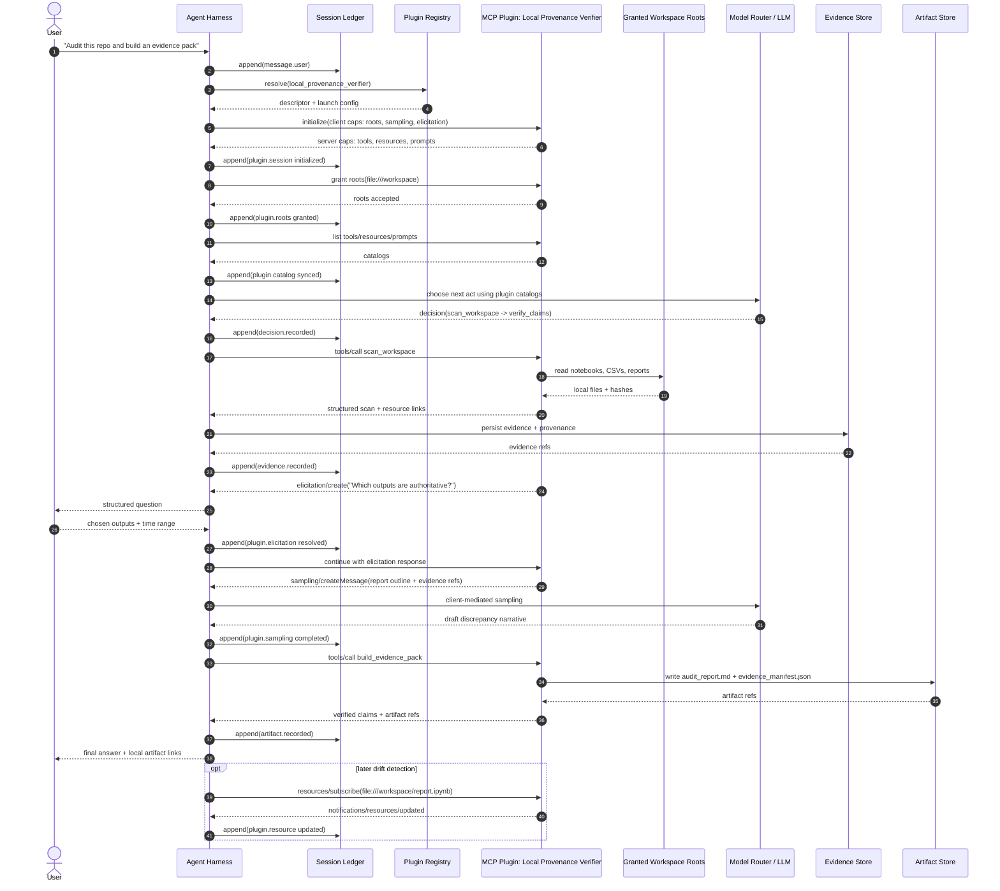

# Agent Harness Sequence Event Narrative

## 1) The 46 events, narrated

This is the **superset path** for the sequence diagram. Optional events are marked.

### Intake

1. `request.received` — UI/API accepts the request and assigns `session_id`, `run_id`, and `turn_id`.
   Persist: transient request context.

2. `message.user.appended` — Append the user message plus `request_type`, auth scope, and run metadata to the **Session Ledger**.
   Persist: Session Ledger.

3. `trace.opened` — Open the trace root span for this run.
   Persist: Trace Store.

4. `run.started` — Create the run record with policy snapshot, tool allowlist, budget, and sandbox profile.
   Persist: Session Ledger.

### First context build

5. `context.compile.requested` — Workflow asks the Context Compiler to assemble model-facing context.
   Persist: Session Ledger or Run Store.

6. `ledger.read.requested` — Compiler reads recent turns, approvals, tool results, summaries, and open loops from the ledger.
   Persist: Trace Store.

7. `memory.retrieve.requested` — Compiler queries warm/cold memory for relevant summaries and durable facts.
   Persist: Trace Store.

8. `memory.retrieve.completed` — Memory layer returns hits and ranking metadata.
   Persist: Trace Store.

9. `context.compiled` — Compiler emits a context package ref with the exact items selected for the model.
   Persist: Session Ledger or Context Cache.

### First inference

10. `model.turn.requested` — Model Router invokes the selected model with compiled context and current tool catalog.
    Persist: Trace Store.

11. `model.turn.completed` — Model returns assistant output, next-step proposal, and possibly tool candidates.
    Persist: Trace Store and optional raw-response blob store.

12. `decision.recorded` — Workflow validates the model output and stores a **DecisionRecord** *before* any side effect.
    Persist: Session Ledger.

### Approval and act dispatch

13. `act.intent.recorded` — Persist the chosen act (tool call, handoff, approval gate, artifact write, prompt fetch, resource read, etc.) before execution.
    Persist: Session Ledger.

14. `approval.requested` *(optional)* — A gated act asks for human approval.
    Persist: Session Ledger.

15. `approval.prompt.presented` *(optional)* — UI presents the approval request to the user/admin.
    Persist: UI audit log or Session Ledger.

16. `approval.responded` *(optional)* — User/admin responds with approve or deny.
    Persist: UI audit log.

17. `approval.recorded` *(optional)* — Durable approval decision is appended.
    Persist: Session Ledger.

18. `act.dispatch.requested` — Workflow dispatches the act to the Tool Broker, MCP connector, artifact writer, or handoff target.
    Persist: Session Ledger.

19. `act.started` — Execution actually begins.
    Persist: Session Ledger.

20. `trace.span.started` — Open a child span for the specific act.
    Persist: Trace Store.

21. `evidence.persist.requested` — Raw result, transcript, file bytes, or structured blob is scheduled for immutable persistence.
    Persist: Trace Store or Session Ledger by ref.

22. `evidence.recorded` — Evidence blob is stored, hashed, and returned as an **EvidenceRef**.
    Persist: Evidence Store + Session Ledger.

23. `act.finished` — Act exits with `completed`, `failed`, `cancelled`, or `denied`, with output refs and error details if any.
    Persist: Session Ledger.

24. `act.result.normalized` — Workflow receives a normalized result shaped for model reuse and downstream logic.
    Persist: Session Ledger by ref or Context Cache.

25. `artifact.persist.requested` *(optional)* — Side effect produced a file, patch, report, screenshot, bundle, or other artifact.
    Persist: Session Ledger or Trace Store.

26. `artifact.persist.completed` *(optional)* — Artifact blob/version is written.
    Persist: Artifact Store.

27. `artifact.recorded` *(optional)* — Append an **ArtifactRef** to the ledger.
    Persist: Session Ledger.

28. `summary.write.requested` *(optional)* — Trigger a checkpoint summary because of subtask completion, phase boundary, pause, or context pressure.
    Persist: Session Ledger or Trace Store.

29. `summary.write.completed` *(optional)* — Memory layer stores the checkpoint summary.
    Persist: Memory Layer.

30. `summary.checkpoint.recorded` *(optional)* — Append a **SummaryCheckpoint** pointing to that new memory object.
    Persist: Session Ledger.

### Rebuild context and second inference

31. `context.recompile.requested` — Workflow asks for a fresh context package with new refs.
    Persist: Session Ledger or Run Store.

32. `ledger.delta.read` — Compiler reads only the new ledger slice since the last compile.
    Persist: Trace Store.

33. `memory.latest_summary.read` — Compiler loads latest checkpoint summary and any promoted facts.
    Persist: Trace Store.

34. `context.recompiled` — New context package is emitted.
    Persist: Session Ledger or Context Cache.

35. `model.next_turn.requested` — Model Router starts the next inference with updated context.
    Persist: Trace Store.

36. `model.next_turn.completed` — Model returns the next decision or final answer plan.
    Persist: Trace Store and optional raw-response blob store.

37. `decision.recorded` — Persist the second validated **DecisionRecord**.
    Persist: Session Ledger.

### Finalization

38. `artifact.finalize.requested` *(optional)* — Promote a draft artifact or write the final deliverable.
    Persist: Session Ledger or Trace Store.

39. `artifact.finalize.completed` *(optional)* — Final artifact version is committed and hashed.
    Persist: Artifact Store + Session Ledger.

40. `final_answer.recorded` — Final assistant message plus evidence/artifact refs is appended.
    Persist: Session Ledger.

41. `run_summary.write.requested` *(optional)* — Trigger end-of-run durable summary write.
    Persist: Trace Store or Session Ledger.

42. `run_summary.write.completed` *(optional)* — Memory layer accepts the end-of-run summary/fact write.
    Persist: Memory Layer.

43. `run_summary.recorded` *(optional)* — Append final **SummaryCheckpoint** or durable memory ref.
    Persist: Session Ledger.

44. `trace.closed` — Trace, metrics, and eval outcome are finalized.
    Persist: Trace/Eval Store.

45. `response.ready` — UI payload is assembled from final answer + artifacts + evidence.
    Persist: UI cache or Session Ledger by ref.

46. `response.delivered` — Final output is emitted to the user/client.
    Persist: delivery audit log.

The five records you asked about appear at these points:

* **DecisionRecord**: 12, 37
* **ActEvent**: 13, 18, 19, 23, 25, 38
* **EvidenceRef**: 22
* **ArtifactRef**: 27, 39
* **SummaryCheckpoint**: 30, 43

## 2) Canonical event schema

### Common envelope

```ts
type ActorType =
  | "user"
  | "assistant"
  | "workflow"
  | "tool"
  | "plugin"
  | "system"
  | "approver";

type Locality = "local" | "remote" | "hybrid";

type ModelVisibility = "include" | "exclude" | "summary_only";
type UserVisibility = "show" | "hide" | "redact";
type OpsVisibility = "full" | "redact";

interface EventEnvelope<TType extends string, TPayload> {
  event_id: string;                 // UUIDv7 or ULID
  type: TType;                      // e.g. "decision.recorded"
  schema_version: string;           // e.g. "2026-03-23"
  occurred_at: string;              // ISO-8601
  session_id: string;
  run_id: string;
  turn_id?: string;

  parent_event_id?: string;
  causation_id?: string;
  correlation_id?: string;
  span_id?: string;

  actor: {
    type: ActorType;
    id: string;
    label?: string;
    provider?: string;
  };

  request_type?: string;            // chat, coding, research, review, etc.
  run_profile_id?: string;          // selected orchestration profile

  visibility: {
    model: ModelVisibility;
    user: UserVisibility;
    ops: OpsVisibility;
  };

  safety: {
    data_classification?: "public" | "internal" | "confidential" | "secret";
    pii?: boolean;
    secrets?: boolean;
    policy_tags?: string[];
  };

  provenance?: {
    source:
      | "ui"
      | "workflow"
      | "memory"
      | "model"
      | "local_tool"
      | "mcp"
      | "plugin"
      | "system";
    provider?: string;
    connector_id?: string;
    server_id?: string;
    transport?: "internal" | "stdio" | "streamable_http" | "http" | "custom";
    locality?: Locality;
  };

  // small inline payload only
  payload: TPayload;

  // namespaced extension bag for forward compatibility
  extensions?: Record<string, unknown>;
}
```

Two durable rules keep this sane:

* Inline only small JSON payloads in the ledger. Anything large becomes an `EvidenceRef` or `ArtifactRef`.
* Never persist raw hidden reasoning. Persist `reason_summary`, `evidence_refs`, `open_loops`, and `selected_option`.

### Core records

```ts
type DecisionKind =
  | "answer_strategy"
  | "tool_selection"
  | "resource_selection"
  | "prompt_application"
  | "sampling_request"
  | "elicitation_request"
  | "artifact_plan"
  | "memory_write"
  | "handoff"
  | "terminate";

interface DecisionRecordPayload {
  decision_id: string;
  kind: DecisionKind;
  stage: "plan" | "act" | "observe" | "finalize";

  reason_summary: string;           // validated summary, not raw hidden reasoning
  selected_option: string;
  alternatives?: Array<{
    option: string;
    rejected_because: string;
  }>;

  input_refs?: string[];
  evidence_refs?: string[];
  expected_outputs?: string[];
  resulting_act_ids?: string[];

  requires_approval: boolean;
  confidence?: number;              // 0..1

  policy_snapshot_id?: string;
  budget_snapshot?: {
    max_turns?: number;
    max_tool_calls?: number;
    max_tokens?: number;
    wall_clock_ms?: number;
  };

  expires_at?: string;
  state_transition?: {
    from: string;
    to: string;
  };
}

type DecisionRecord =
  EventEnvelope<"decision.recorded", DecisionRecordPayload>;

type ActKind =
  | "tool_call"
  | "mcp_tool_call"
  | "mcp_prompt_get"
  | "mcp_resource_read"
  | "mcp_resource_subscribe"
  | "mcp_sampling"
  | "mcp_elicitation"
  | "approval_gate"
  | "handoff"
  | "artifact_write"
  | "message_emit";

type ActPhase =
  | "intent"
  | "requested"
  | "started"
  | "progress"
  | "completed"
  | "failed"
  | "cancelled"
  | "denied";

interface ActEventPayload {
  act_id: string;
  parent_decision_id?: string;

  kind: ActKind;
  phase: ActPhase;

  target: {
    type:
      | "local_tool"
      | "mcp_server"
      | "memory"
      | "artifact_store"
      | "user"
      | "workflow"
      | "model";
    connector_id?: string;
    server_id?: string;
    tool_name?: string;
    prompt_name?: string;
    resource_uri?: string;
    operation?: string;
  };

  input_ref?: string;
  input_hash?: string;
  timeout_ms?: number;
  retry_of_act_id?: string;
  idempotency_key?: string;

  declared_annotations?: {
    title?: string;
    read_only_hint?: boolean;
    destructive_hint?: boolean;
    idempotent_hint?: boolean;
    open_world_hint?: boolean;
  };

  enforced_policy?: {
    approval_mode?: "none" | "user" | "admin";
    sandbox_profile?: string;
    network?: "off" | "allowlist" | "full";
    root_scope_ref?: string;
  };

  side_effects?: "none" | "read_only" | "additive" | "destructive";
  output_refs?: string[];

  error?: {
    code: string;
    message: string;
    retryable: boolean;
  };
}

type ActEvent = EventEnvelope<"act.event", ActEventPayload>;

interface EvidenceRefPayload {
  evidence_id: string;
  uri: string;                      // store://evidence/... or file://...
  hash: {
    alg: "sha256" | "blake3";
    value: string;
  };

  mime_type?: string;
  size_bytes?: number;

  source_kind:
    | "tool_result"
    | "mcp_resource"
    | "mcp_prompt_output"
    | "mcp_sampling_output"
    | "user_upload"
    | "workspace_file"
    | "web_result"
    | "generated_intermediate";

  collected_by_act_id?: string;
  derived_from?: string[];

  provenance: {
    observed_at: string;
    connector_id?: string;
    server_id?: string;
    tool_name?: string;
    prompt_name?: string;
    resource_uri?: string;
    transport?: "internal" | "stdio" | "streamable_http" | "http" | "custom";
    locality?: Locality;
  };

  annotations?: {
    audience?: Array<"user" | "assistant" | "system">;
    priority?: number;              // 0..1
    last_modified?: string;
  };

  structured_schema_ref?: string;
  attestation?: {
    signer?: string;
    signature?: string;
  };

  retention?: {
    ttl_days?: number;
    pin?: boolean;
  };
}

type EvidenceRef = EventEnvelope<"evidence.recorded", EvidenceRefPayload>;

interface ArtifactRefPayload {
  artifact_id: string;
  uri: string;                      // store://artifacts/... or file://...
  kind:
    | "report"
    | "patch"
    | "file"
    | "table"
    | "image"
    | "notebook"
    | "manifest"
    | "bundle";

  status: "draft" | "final" | "superseded";
  version: number;
  parent_artifact_id?: string;

  mime_type?: string;
  hash?: {
    alg: "sha256" | "blake3";
    value: string;
  };

  created_by_act_id?: string;
  derived_from_evidence?: string[];
  derived_from_summaries?: string[];

  manifest_ref?: string;
  display_name?: string;
  user_visible: boolean;
  open_with?: string;

  write_scope?: {
    root_uri: string;
    mode: "read" | "write";
  };
}

type ArtifactRef = EventEnvelope<"artifact.recorded", ArtifactRefPayload>;

interface SummaryCheckpointPayload {
  summary_id: string;
  scope: "turn" | "subtask" | "handoff" | "compaction" | "run";
  checkpoint_reason:
    | "context_pressure"
    | "phase_end"
    | "tool_boundary"
    | "pause"
    | "handoff"
    | "run_complete";

  title?: string;
  summary_text: string;

  salient_facts: string[];
  decisions: string[];              // decision_ids
  open_loops: string[];

  evidence_refs: string[];
  artifact_refs: string[];

  memory_namespace: string;
  supersedes?: string[];
  compression_ratio?: number;
}

type SummaryCheckpoint =
  EventEnvelope<"summary.checkpoint", SummaryCheckpointPayload>;
```

### Additional records needed for community plug-ins

I would add these as the minimum plugin-support family. I split them because MCP itself has separate lifecycle/capability, catalog, roots, resources, prompts, sampling, and elicitation surfaces, and because tools/resources/prompts may change over time via list-change notifications or subscriptions. ([Model Context Protocol][3])

I also give sampling and elicitation first-class events because they are not ordinary tools: sampling is a client-controlled path for nested model calls, and elicitation is a structured user-input path with explicit safety expectations, including not soliciting sensitive information. ([Model Context Protocol][4])

```ts
interface ApprovalEventPayload {
  approval_id: string;
  requested_for_event_id: string;
  scope:
    | "tool_use"
    | "artifact_write"
    | "network_access"
    | "sampling"
    | "plugin_connect"
    | "root_grant";

  presented_to: string;
  decision: "approved" | "denied" | "expired";
  reason?: string;
}

type ApprovalEvent =
  EventEnvelope<"approval.event", ApprovalEventPayload>;

interface PluginSessionEventPayload {
  plugin_id: string;
  connector_id: string;
  protocol: "mcp";

  phase:
    | "registered"
    | "initialize_requested"
    | "initialized"
    | "connected"
    | "disconnected"
    | "failed";

  transport: "stdio" | "streamable_http" | "http" | "custom";
  protocol_version?: string;
  locality: Locality;
  trust_level: "builtin" | "verified" | "third_party" | "untrusted";

  client_capabilities?: Record<string, unknown>;
  server_capabilities?: Record<string, unknown>;
  instructions?: string;

  error?: {
    code: string;
    message: string;
  };
}

type PluginSessionEvent =
  EventEnvelope<"plugin.session", PluginSessionEventPayload>;

interface RootScopeEventPayload {
  plugin_id: string;
  connector_id: string;
  operation: "granted" | "changed" | "revoked";

  roots: Array<{
    uri: string;
    mode: "read" | "write";
    recursive: boolean;
  }>;

  granted_by: string;
  expires_at?: string;
}

type RootScopeEvent =
  EventEnvelope<"plugin.roots", RootScopeEventPayload>;

interface PluginCatalogEventPayload {
  plugin_id: string;
  connector_id: string;
  catalog: "tools" | "resources" | "prompts";
  operation: "synced" | "list_changed";

  item_names: string[];
  catalog_ref?: string;             // full catalog blob if large
  delta?: {
    added?: string[];
    removed?: string[];
    changed?: string[];
  };
}

type PluginCatalogEvent =
  EventEnvelope<"plugin.catalog", PluginCatalogEventPayload>;

interface ResourceEventPayload {
  plugin_id: string;
  connector_id: string;
  operation:
    | "listed"
    | "read_requested"
    | "read_completed"
    | "subscribed"
    | "unsubscribed"
    | "updated";

  uri: string;
  mime_type?: string;
  size_bytes?: number;
  hash?: string;
  evidence_ref_id?: string;
  subscription_id?: string;

  annotations?: {
    audience?: Array<"user" | "assistant" | "system">;
    priority?: number;
    last_modified?: string;
  };
}

type ResourceEvent =
  EventEnvelope<"plugin.resource", ResourceEventPayload>;

interface PromptEventPayload {
  plugin_id: string;
  connector_id: string;
  operation: "listed" | "resolved" | "applied" | "list_changed";

  prompt_name: string;
  arguments?: Record<string, string>;
  message_ref?: string;
}

type PromptEvent =
  EventEnvelope<"plugin.prompt", PromptEventPayload>;

interface SamplingEventPayload {
  plugin_id: string;
  connector_id: string;
  operation: "requested" | "approved" | "completed" | "denied" | "failed";

  messages_ref: string;
  model_preferences?: Record<string, unknown>;
  human_in_loop: boolean;
  output_evidence_ref?: string;

  error?: {
    code: string;
    message: string;
  };
}

type SamplingEvent =
  EventEnvelope<"plugin.sampling", SamplingEventPayload>;

interface ElicitationEventPayload {
  plugin_id: string;
  connector_id: string;
  operation: "requested" | "presented" | "resolved" | "declined" | "timed_out";

  title: string;
  schema: Record<string, unknown>;
  requested_fields: string[];

  response_ref?: string;
  decline_reason?: string;
  sensitive_fields_requested?: boolean; // should stay false
}

type ElicitationEvent =
  EventEnvelope<"plugin.elicitation", ElicitationEventPayload>;

interface PluginProgressEventPayload {
  plugin_id: string;
  connector_id: string;
  task_id: string;

  phase: "started" | "progress" | "completed" | "failed";
  message?: string;
  progress?: number;               // 0..1
  evidence_ref_id?: string;
}

type PluginProgressEvent =
  EventEnvelope<"plugin.progress", PluginProgressEventPayload>;

/**
 * Escape hatch for community-built, domain-specific events.
 * Use reverse-DNS namespace + versioned schema_uri.
 */
interface PluginExtensionEventPayload<T = Record<string, unknown>> {
  plugin_id: string;
  connector_id: string;
  namespace: string;               // e.g. "io.acme.provenance"
  name: string;                    // e.g. "claim.verified"
  schema_uri: string;              // versioned JSON Schema URI

  payload?: T;                     // inline when small
  payload_ref?: string;            // blob ref when large
}

type PluginExtensionEvent<T = Record<string, unknown>> =
  EventEnvelope<"plugin.extension", PluginExtensionEventPayload<T>>;
```

## 3) Example future community plug-in

A good future plugin is a **Local Provenance Verifier**. The user asks the harness to audit a repo/notebook folder, verify claims against local evidence, and build an evidence pack without uploading the workspace. That fits MCP well because **roots** bound the local filesystem surface, **resources** give the harness URI-addressable context, **elicitation** can ask the user which outputs count as authoritative, **sampling** lets the plugin borrow host/client model access instead of shipping its own API key, and **resource subscriptions** can later detect drift when files change. ([Model Context Protocol][5])

### Sequence diagram



### Event schema for this plug-in

This plugin can reuse the core records and add a small namespaced domain event family.

```ts
type LocalProvenanceVerifierEvent =
  | PluginSessionEvent
  | RootScopeEvent
  | PluginCatalogEvent
  | ResourceEvent
  | ElicitationEvent
  | SamplingEvent
  | ActEvent
  | EvidenceRef
  | ArtifactRef
  | PluginExtensionEvent<ClaimExtractedData>
  | PluginExtensionEvent<ClaimVerifiedData>
  | PluginExtensionEvent<EvidencePackBuiltData>;

interface ClaimExtractedData {
  claim_id: string;
  claim_text: string;

  source_resource_uri: string;     // e.g. file:///workspace/analysis.ipynb
  source_locator: string;          // e.g. "#cell=14"
  extracted_by_act_id: string;
}

interface ClaimVerifiedData {
  claim_id: string;
  claim_text: string;

  verdict: "supported" | "contradicted" | "insufficient_evidence";
  supporting_evidence: string[];
  contradicting_evidence?: string[];

  subject_refs: string[];          // file/cell/chart refs
  confidence: number;
}

interface EvidencePackBuiltData {
  pack_id: string;
  report_artifact_id: string;
  manifest_artifact_id: string;
  included_claim_ids: string[];
  included_evidence_refs: string[];
}
```

### Example instance

```json
{
  "event_id": "01JQZV6Q2D48K4N9H0K3YQ4Y8F",
  "type": "plugin.extension",
  "schema_version": "2026-03-23",
  "occurred_at": "2026-03-23T18:14:02Z",
  "session_id": "ses_01JQZV3Y...",
  "run_id": "run_01JQZV40...",
  "actor": {
    "type": "plugin",
    "id": "local_provenance_verifier"
  },
  "visibility": {
    "model": "summary_only",
    "user": "hide",
    "ops": "full"
  },
  "payload": {
    "plugin_id": "local_provenance_verifier",
    "connector_id": "mcp.local.provenance",
    "namespace": "io.acme.provenance",
    "name": "claim.verified",
    "schema_uri": "schema://io.acme.provenance/claim.verified.v1",
    "payload": {
      "claim_id": "clm_0042",
      "claim_text": "Gross margin improved 4.2% QoQ",
      "verdict": "supported",
      "supporting_evidence": ["evi_01JQ...", "evi_01JR..."],
      "contradicting_evidence": [],
      "subject_refs": ["file:///workspace/analysis.ipynb#cell=14"],
      "confidence": 0.93
    }
  }
}
```

## 4) Practical design rules

1. **Persist control-plane before side effects.**
   `DecisionRecord` first, then `ActEvent(intent)`, then execution.

2. **Persist blobs first, refs second.**
   Evidence and artifacts are immutable stores plus ledger refs, not giant inline payloads.

3. **Separate declared hints from enforced policy.**
   Tool annotations are advisory; approvals, roots, sandboxing, and network policy live in your harness.

4. **Give plug-ins a core family plus an extension family.**
   Use stable built-in events for sessions, roots, catalogs, resources, prompts, sampling, elicitation, acts, evidence, artifacts. Use `plugin.extension` for domain-specific events with reverse-DNS namespaces.

5. **Keep the ledger provider-neutral.**
   Adapters can lower `plugin.resource` and `plugin.prompt` into plain context or synthetic tool acts when targeting tool-only clients, while your ledger keeps the richer truth.

The clean implementation order is: `EventEnvelope`, the five core records, the plugin family, then one real plugin namespace such as `io.acme.provenance`.

[1]: https://modelcontextprotocol.io/specification/2025-11-25 "https://modelcontextprotocol.io/specification/2025-11-25"
[2]: https://modelcontextprotocol.io/specification/2025-11-25/schema "https://modelcontextprotocol.io/specification/2025-11-25/schema"
[3]: https://modelcontextprotocol.io/specification/2025-03-26/basic/lifecycle "https://modelcontextprotocol.io/specification/2025-03-26/basic/lifecycle"
[4]: https://modelcontextprotocol.io/specification/2025-11-25/client/sampling "https://modelcontextprotocol.io/specification/2025-11-25/client/sampling"
[5]: https://modelcontextprotocol.io/specification/2025-06-18/client/roots "https://modelcontextprotocol.io/specification/2025-06-18/client/roots"
